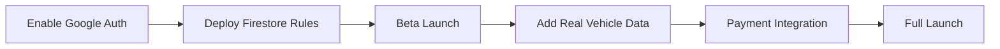

# 🚌 Commute Companion

**Your Smart Campus Ride-Pooling Solution**

Commute Companion is a modern, AI-powered transportation platform designed specifically for students in Knowledge Park, Greater Noida. It connects daily commuters to share rides, split fares, and travel affordably with verified co-travellers.


---

## 📊 Production Readiness Assessment

### Overall Score: **7.5/10** - Ready for Beta Launch

| Category | Score | Status |
|----------|-------|--------|
| **Core Features** | 9/10 | ✅ Complete |
| **Mobile Optimization** | 9/10 | ✅ Complete |
| **Authentication** | 8/10 | ✅ Working |
| **Database & Security** | 7/10 | ⚠️ Needs Rules Deployment |
| **AI Features** | 7/10 | ⚠️ Requires API Key |
| **Real Data** | 5/10 | ⚠️ Currently Mocked |
| **Payment Integration** | 0/10 | ❌ Not Implemented |
| **Push Notifications** | 0/10 | ❌ Not Implemented |

### ✅ What's Production Ready

| Feature | Details |
|---------|---------|
| **Google Sign-In** | Secure OAuth with redirect method |
| **Mobile-First UI** | Bottom navigation, touch targets, safe areas |
| **Ride Sharing** | Post, search, request to join rides |
| **Rewards System** | Points, redemption, vouchers with Firestore transactions |
| **Safety Features** | SOS button, emergency contacts, trip sharing |
| **AI Predictions** | Bus crowd levels, delay explanations (with API key) |
| **Live Tracking** | Google Maps integration with vehicle markers |
| **User Profiles** | Preferences, college info, photo |
| **Real-time Updates** | Firestore onSnapshot for live data |

### ⚠️ Improvements Needed for Production

| Priority | Item | Effort | Impact |
|----------|------|--------|--------|
| 🔴 **High** | Deploy Firestore security rules to Firebase | 5 min | Critical for data security |
| 🔴 **High** | Enable Google Sign-In in Firebase Console | 2 min | Authentication won't work without this |
| 🔴 **High** | Add real vehicle data from GPS devices | 1-2 weeks | Core functionality |
| 🟡 **Medium** | Implement push notifications | 1 week | User engagement |
| 🟡 **Medium** | Add payment gateway (Razorpay/UPI) | 1 week | Monetization |
| 🟡 **Medium** | Admin dashboard for vehicle management | 1-2 weeks | Operations |
| 🟡 **Medium** | QR code generation for vouchers | 2 days | Reward redemption |
| 🟢 **Low** | Rate limiting for API calls | 1 day | Abuse prevention |
| 🟢 **Low** | Error monitoring (Sentry) | 2 hours | Production debugging |
| 🟢 **Low** | Analytics dashboard | 3 days | Business insights |

### 🚀 Recommended Launch Sequence



---

## 📋 Table of Contents

- [Production Readiness](#-production-readiness-assessment)
- [Features](#-features)
- [Tech Stack](#-tech-stack)
- [Project Structure](#-project-structure)
- [Getting Started](#-getting-started)
- [Environment Variables](#-environment-variables)
- [Firebase Setup](#-firebase-setup)
- [AI Features](#-ai-features)
- [Security](#-security)
- [Mobile Optimization](#-mobile-optimization)
- [Roadmap](#-roadmap)
- [Contributing](#-contributing)

---

## ✨ Features

### 🗺️ Live Vehicle Tracking
- **Real-time GPS tracking** of buses and cabs on an interactive Google Maps interface
- **Crowd-level indicators** (Green/Yellow/Red) showing vehicle capacity status
- **Bus stop markers** displayed along routes for easy navigation
- **Offline persistence** with Firestore IndexedDB for seamless experience
- **Mobile-optimized** aspect ratio map with zoom controls

### 🚗 Ride Sharing System
- **Post rides** as a driver with customizable options (seats, price, date, preferences)
- **Find rides** going your way with real-time matching
- **Request to join** available rides with driver approval system
- **Gender-preference matching** for added comfort and safety
- **Ride preferences** including smoking and music allowance settings
- **Floating Action Button** for quick ride posting

### 🤖 AI-Powered Intelligence (Google Gemini)
- **Bus crowd prediction** based on time, day, and academic calendar events
- **Delay explanation** with contextual reasoning for late buses
- **Smart suggestions** to avoid crowded buses during peak hours

### 🎮 Gamified Rewards System
- **Earn points** for every ride, crowd report, and interaction
- **Redeem rewards** including:
  - ₹50 Ride Vouchers
  - Amazon Gift Cards
  - Blinkit Vouchers
  - Sharda Canteen Coupons
- **Track redeemed vouchers** with QR code display
- **Transaction-safe** point redemption with Firestore transactions

### 🛡️ Safety Features
- **Emergency SOS button** with countdown and instant alerts
- **Emergency contacts management** with quick-dial functionality
- **Trip sharing** to let friends/family track your journey
- **Verified user system** for trusted community building
- **Female-only matching** option for added safety
- **Safety tips** integrated in the app

### 👤 User Profile Management
- **Google Sign-In** for secure, passwordless authentication
- **Complete profile setup** with personal information
- **Ride preferences** configuration (smoking, music, gender preference)
- **Account deletion** with full data removal
- **Prominent logout button** in profile settings

### 📱 Mobile-First Design
- **Bottom navigation** pattern for easy thumb access
- **Touch targets** minimum 44px for accessibility
- **Safe area handling** for notched phones
- **Gradient headers** and glassmorphism effects
- **Smooth animations** with hardware acceleration
- **Dark theme** landing page with emerald-cyan accents

---

## 🛠️ Tech Stack

### Frontend
| Technology | Purpose |
|------------|---------|
| **Next.js 15.5** | React framework with App Router & Turbopack |
| **TypeScript 5** | Type-safe development |
| **TailwindCSS 3.4** | Utility-first CSS styling |
| **Radix UI** | Accessible, unstyled component primitives |
| **Lucide React** | Beautiful, consistent icons |
| **React Hook Form** | Performant form handling |
| **Zod** | TypeScript-first schema validation |

### Backend & Services
| Technology | Purpose |
|------------|---------|
| **Firebase Auth** | Google OAuth authentication |
| **Cloud Firestore** | Real-time NoSQL database |
| **Firebase Analytics** | User behavior tracking |
| **Google Maps API** | Interactive maps and static map images |
| **Google Genkit AI** | AI flows for predictions and explanations |
| **Gemini Pro** | Large language model for AI features |

### Development Tools
| Tool | Purpose |
|------|---------|
| **Turbopack** | Fast development builds |
| **ESLint** | Code linting |
| **date-fns** | Date manipulation |

---

## 📁 Project Structure

```
campus-commute/
├── src/
│   ├── app/                    # Next.js App Router
│   │   ├── page.tsx            # Mobile-first dark landing page
│   │   ├── login/              # Google Sign-In page
│   │   ├── dashboard/          # Protected dashboard routes
│   │   │   ├── layout.tsx      # Dashboard layout with bottom nav
│   │   │   ├── page.tsx        # Home (live tracking)
│   │   │   ├── ride-sharing/   # Ride sharing page
│   │   │   ├── rewards/        # Rewards & points page
│   │   │   ├── my-rides/       # User's redeemed rides
│   │   │   ├── safety/         # Safety features page
│   │   │   └── profile/        # User profile & logout
│   │   ├── globals.css         # Mobile utilities & CSS variables
│   │   └── layout.tsx          # Root layout with safe areas
│   │
│   ├── components/             # React components
│   │   ├── ui/                 # Shadcn/ui components (35+)
│   │   ├── commute-dashboard.tsx    # Mobile dashboard with bottom nav
│   │   ├── live-tracking.tsx        # Google Maps with vehicle chips
│   │   ├── vehicle-card.tsx         # Vehicle details with actions
│   │   ├── ride-sharing.tsx         # Ride listing with FAB
│   │   ├── post-ride-dialog.tsx     # Post new ride form
│   │   ├── rewards.tsx              # Points & rewards grid
│   │   ├── safety-shield.tsx        # SOS & emergency contacts
│   │   ├── profile.tsx              # Profile settings & logout
│   │   ├── notification-bell.tsx    # Ride request notifications
│   │   ├── my-free-rides.tsx        # Voucher cards with QR
│   │   └── logo.tsx                 # App logo component
│   │
│   ├── ai/                     # Genkit AI integration
│   │   ├── genkit.ts           # Genkit configuration
│   │   └── flows/
│   │       ├── predict-bus-crowd-levels.ts
│   │       └── explain-bus-delays.ts
│   │
│   ├── lib/                    # Utilities & configuration
│   │   ├── firebase.ts         # Firebase with Google Auth
│   │   ├── types.ts            # TypeScript definitions
│   │   ├── bus-stops.ts        # Bus stop data
│   │   └── utils.ts            # Utility functions
│   │
│   └── hooks/                  # Custom React hooks
│       ├── use-toast.ts
│       └── use-mobile.tsx
│
├── firestore.rules             # Security rules
├── next.config.ts              # COOP headers for auth
└── package.json
```

---

## 🚀 Getting Started

### Prerequisites

- **Node.js** 18+ 
- **npm** or **yarn**
- **Firebase project** with Firestore enabled
- **Google Maps API key** with Maps JavaScript API enabled
- **Gemini API key** for AI features

### Installation

1. **Clone the repository**
   ```bash
   git clone https://github.com/yourusername/campus-commute.git
   cd campus-commute
   ```

2. **Install dependencies**
   ```bash
   npm install
   ```

3. **Set up environment variables** (see [Environment Variables](#-environment-variables))

4. **Enable Google Sign-In in Firebase Console**
   - Go to Authentication → Sign-in method → Google → Enable

5. **Deploy Firestore rules**
   ```bash
   firebase deploy --only firestore:rules
   ```

6. **Run the development server**
   ```bash
   npm run dev
   ```

7. **Open the app**
   Navigate to [http://localhost:9002](http://localhost:9002)

### Available Scripts

| Script | Description |
|--------|-------------|
| `npm run dev` | Start development server with Turbopack on port 9002 |
| `npm run build` | Build for production |
| `npm run start` | Start production server |
| `npm run lint` | Run ESLint |
| `npm run typecheck` | Run TypeScript type checking |
| `npm run genkit:dev` | Start Genkit AI development server |

---

## 🔐 Environment Variables

Create a `.env.local` file in the root directory:

```env
# Google AI (Gemini)
GEMINI_API_KEY="your_gemini_api_key"

# Google Maps
GOOGLE_MAPS_API_KEY="your_google_maps_api_key"

# Firebase Configuration
NEXT_PUBLIC_FIREBASE_API_KEY=your_firebase_api_key
NEXT_PUBLIC_FIREBASE_AUTH_DOMAIN=your-project.firebaseapp.com
NEXT_PUBLIC_FIREBASE_PROJECT_ID=your-project-id
NEXT_PUBLIC_FIREBASE_STORAGE_BUCKET=your-project.firebasestorage.app
NEXT_PUBLIC_FIREBASE_MESSAGING_SENDER_ID=your_sender_id
NEXT_PUBLIC_FIREBASE_APP_ID=your_app_id
NEXT_PUBLIC_FIREBASE_MEASUREMENT_ID=G-XXXXXXXXXX
```

---

## 🔥 Firebase Setup

### 1. Enable Google Sign-In

1. Go to [Firebase Console](https://console.firebase.google.com)
2. Select your project
3. Go to **Authentication** → **Sign-in method**
4. Click **Google** → Toggle **Enable** → Save

### 2. Deploy Security Rules

```bash
firebase login
firebase deploy --only firestore:rules
```

### Firestore Collections

| Collection | Description |
|------------|-------------|
| `users/{userId}` | User profiles and settings |
| `users/{userId}/emergency_contacts` | Emergency contact list |
| `redeemed_vouchers` | Redeemed reward vouchers |
| `vehicles/{vehicleId}` | Real-time vehicle data |
| `rides/{rideId}` | Available ride shares |
| `ride_requests/{requestId}` | Ride join requests |

### Security Rules Summary

- **Users** can only read/write their own data
- **Vehicles** are read-only for authenticated users
- **Rides** can be created by any authenticated user
- **Ride requests** follow proper authorization flow
- **Vouchers** are scoped to the user who redeemed them

---

## 📱 Mobile Optimization

### Design System

| Token | Value |
|-------|-------|
| **Border Radius** | `rounded-2xl` (16px) |
| **Touch Target** | Minimum 44px height |
| **Safe Areas** | `env(safe-area-inset-*)` |
| **Gradients** | Emerald → Cyan accent |
| **Background** | Dark `#0A0A0F` |

### Mobile Navigation Pattern

```
┌─────────────────────────────────┐
│  [Logo]  Welcome   🔔 [Avatar]  │  ← Sticky Header
├─────────────────────────────────┤
│  ┌─────────────────────────────┐│
│  │  [Gradient Points Card]     ││
│  └─────────────────────────────┘│
│                                 │
│  [🗺️ Track] [🚗 Rides] [🏆] [🎫]│  ← Quick Actions
│                                 │
│         [Page Content]          │
│                                 │
├─────────────────────────────────┤
│  🏠   👥   🏆   🛡️   👤         │  ← Bottom Nav
└─────────────────────────────────┘
```

### CSS Utilities Added

- `safe-top`, `safe-bottom`, `safe-all` - Device safe areas
- `touch-target` - Minimum 44px touch area
- `scrollbar-hide` - Hide scrollbars (keep scroll)
- `animate-slide-up`, `animate-fade-in` - Smooth animations

---

## 🤖 AI Features

### Bus Crowd Level Prediction

Predicts how crowded a bus will be based on:
- Route ID
- Time of day
- Day of the week
- Academic calendar events (exams, holidays)

Returns a crowd level (Green/Yellow/Red) with an explanation.

### Bus Delay Explanation

Provides intelligent explanations for bus delays considering:
- Traffic conditions
- Time of day patterns
- Weather factors
- Special events

---

## 🗺️ Roadmap

### ✅ Completed
- [x] Google Sign-In integration
- [x] Mobile-first responsive design
- [x] Bottom navigation for mobile
- [x] Dark theme landing page
- [x] Real-time ride sharing
- [x] Gamified rewards system
- [x] Emergency SOS features
- [x] AI crowd predictions

### 🔜 Coming Soon
- [ ] Push notifications for ride updates
- [ ] Payment integration (UPI/Razorpay)
- [ ] Real-time chat between riders
- [ ] Admin dashboard for vehicle management
- [ ] QR code generation for vouchers
- [ ] Route optimization suggestions
- [ ] Carbon footprint tracking

### Known Limitations
- Vehicle data is currently mocked
- QR codes for vouchers are placeholder
- Bus stops are pre-defined (not dynamic)

---

## 🤝 Contributing

Contributions are welcome! Please follow these steps:

1. Fork the repository
2. Create a feature branch (`git checkout -b feature/amazing-feature`)
3. Commit your changes (`git commit -m 'Add amazing feature'`)
4. Push to the branch (`git push origin feature/amazing-feature`)
5. Open a Pull Request

---

## 📄 License

This project is developed as a Final Year project at Sharda University, Knowledge Park, Greater Noida.

---

## 📞 Contact

- **Email:** campuscommute.info@gmail.com
- **Location:** Sharda University, Knowledge Park, Greater Noida

---

<p align="center">
  Made with ❤️ for the campus community
  <br>
  <strong>© 2025 Commute Companion. All rights reserved.</strong>
</p>
